# 服薬管理アプリ

## 制作のきっかけ

「服薬状況を**簡単に**記録できるアプリがあったらいいな」と自分自身が思ったことがきっかけ。

### 市販のアプリの課題点

- 簡単に編集できると「**後で編集したらいいや**」と記録付けを後回しにして長続きしない
- 全く編集できないと記録忘れした時に「**もうやめよう**」と完璧主義が発動して長続きしない
- 服薬タイミングごとのカスタマイズの難しさ

### 独自アプリのメリット

市販のアプリでは実現が難しかった「継続するための仕組み」を、自身の特性に合わせて最適化することで、以下のメリット（行動変容）を実現しました。

- **ゲーム感覚での継続（服薬忘れ防止）** 
  子どもの「できたよシール集め」のような楽しさを取り入れ、履歴がコンプリートされていく視覚的な達成感でモチベーションを維持します。
- **ワンタップで完結する極小の操作負荷** 
  「いつ・何を・どれくらい服薬したか」をボタン一つで瞬間的に記録でき、日常的な入力の手間を徹底的に排除しました。
- **完璧主義の挫折を防ぐ「安心の担保」** 
  「基本画面は変更不可にしてその場での記録を促す」一方で、「過去の記録をいつでも修復できる隠れた管理画面」を用意。安易な後回しを防ぎつつ、データの一貫性を保ちたい心理に寄り添います。

## 服薬状況を記録するAppSheetアプリ

### AppSheetとは

Googleスプレッドシートをデータベースとして使用し、入力・閲覧画面を本格的なアプリケーションのように構築できるローコードツール

### AppSheetを選択した理由

データ管理はスプレッドシート、画面は標準テンプレートで十分要件を満たせると判断し、『**最小限の開発コストで、実用性の高いアプリを最速で形にする**』ためにAppSheetを選定

|   #   | 選定の軸             | 判断基準と理由                                                                                                   |
| :---: | :------------------- | :--------------------------------------------------------------------------------------------------------------- |
| **1** | **データ管理の適正** | 記録する項目がシンプルであり、Googleスプレッドシートをデータベースとして活用すれば十分に管理可能と判断したため。 |
| **2** | **UI構築の効率性**   | 標準的なテンプレート画面でアプリとしての要件を100%満たせるため、デザインをゼロから組む必要がないと判断したため。 |
| **3** | **開発スピード重視** | 最小限のコストで「サクッと、かつ実用的なレベル」まで迅速に作り込みたかったため。                                 |

### 画面遷移図

  
■トップメニュー

   

> 日常的に操作を行う基本画面 
> 服薬項目の追加と日常の記録、履歴の閲覧のみが可能な仕様に制限をしている 

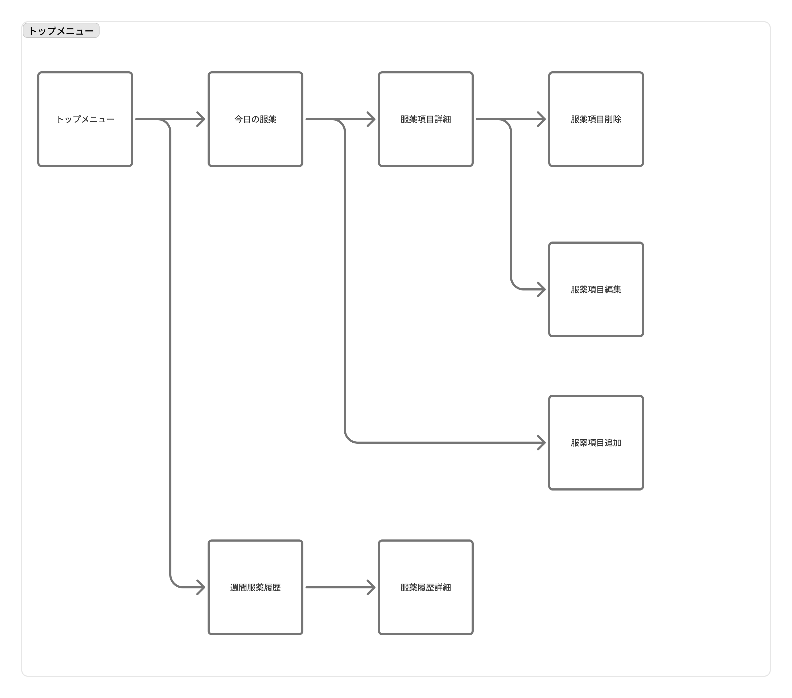

  
■サイドメニュー

   

> 総合的な操作を行う画面 
> 服薬項目の追加、編集、削除など、データの修正作業も可能な仕様になっている 

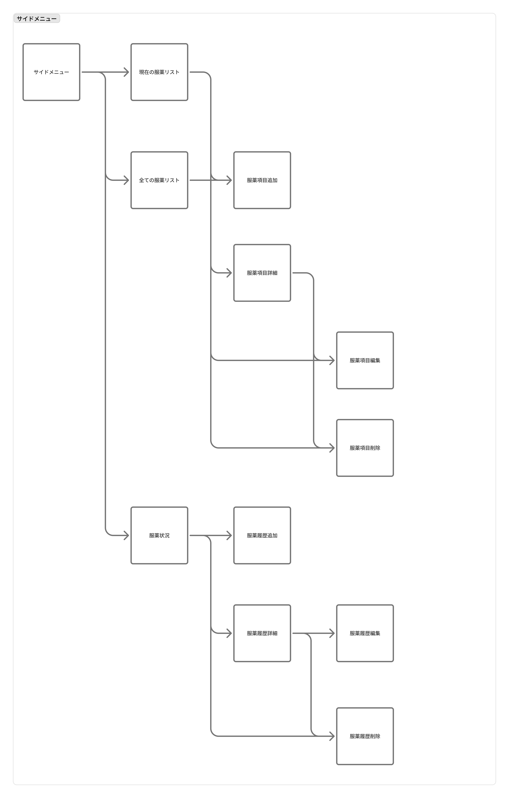

### 画面機能詳細

#### ① メインメニュー・一覧画面

日常のハブとなる画面と、サイドから入る全データの一覧画面です。

| 項番  | 画面名               | 主な遷移元         | 役割・主な機能                                                                |
| :---: | :------------------- | :----------------- | :---------------------------------------------------------------------------- |
| **1** | **トップメニュー**   | アプリ起動時       | 日常の服薬記録や直近1週間の履歴へアクセスするメインのハブ画面。               |
| **2** | **サイドメニュー**   | 画面左上メニュー等 | 管理・修復機能（マスターデータ）へアクセスするためのナビゲーション。          |
| **3** | **今日の服薬**       | トップメニュー     | 当日中に飲むべき薬の確認、および服薬完了のワンタップ記録を行う画面。          |
| **4** | **週間服薬履歴**     | トップメニュー     | 直近1週間の服薬ログ（できたよシール感覚の履歴）を一覧で視覚的に確認する画面。 |
| **5** | **現在の服薬リスト** | サイドメニュー     | 現在進行形で稼働している服薬スケジュールの一覧画面。                          |
| **6** | **全ての服薬リスト** | サイドメニュー     | 過去の履歴を含めた、登録されている全服薬項目のマスター一覧画面。              |
| **7** | **服薬状況**         | サイドメニュー     | これまでのすべての服薬履歴・実績ログを集中管理（閲覧）する画面。              |

#### ② 【共通】服薬マスタ管理画面

薬そのものの情報（名前やスケジュールなど）を設定・操作する画面です。

|  項番  | 画面名           | 主な遷移元                      | 役割・主な機能                                                     |
| :----: | :--------------- | :------------------------------ | :----------------------------------------------------------------- |
| **8**  | **服薬項目詳細** | 今日の服薬 / 全ての服薬リスト   | 選択した服薬項目の具体的な情報（薬名・用量など）を確認する画面。   |
| **9**  | **服薬項目追加** | 今日の服薬 / 全ての服薬リスト   | 新しい服薬スケジュールや項目を追加する画面。                       |
| **10** | **服薬項目編集** | 服薬項目詳細 / 全ての服薬リスト | 登録されている服薬項目の内容（スケジュールや薬名）を変更する画面。 |
| **11** | **服薬項目削除** | 服薬項目詳細 / 全ての服薬リスト | 不要になった服薬項目をマスターから削除する画面。                   |

#### ③ 【共通】服薬履歴（ログ）管理画面

「いつ飲んだか」という、蓄積された過去の記録を操作・修復する画面です。

|  項番  | 画面名           | 主な遷移元              | 役割・主な機能                                                                   |
| :----: | :--------------- | :---------------------- | :------------------------------------------------------------------------------- |
| **12** | **服薬履歴詳細** | 週間服薬履歴 / 服薬状況 | 過去の特定の服薬ログに関する詳細な時間等の記録を確認する画面。                   |
| **13** | **服薬履歴追加** | 服薬状況                | 記録漏れがあった際など、過去の日時に遡って服薬履歴を手動で登録（修復）する画面。 |
| **14** | **服薬履歴編集** | 服薬履歴詳細            | 記録された服薬時間や内容を、後から正確な情報に修正（修復）する画面。             |
| **15** | **服薬履歴削除** | 服薬履歴詳細 / 服薬状況 | 誤って登録してしまった服薬履歴ログを消去する画面。                               |

### 画面イメージ

|                                                 今日の服薬                                                 |                    週間服薬履歴                    |
| :--------------------------------------------------------------------------------------------------------: | :------------------------------------------------: |
|                              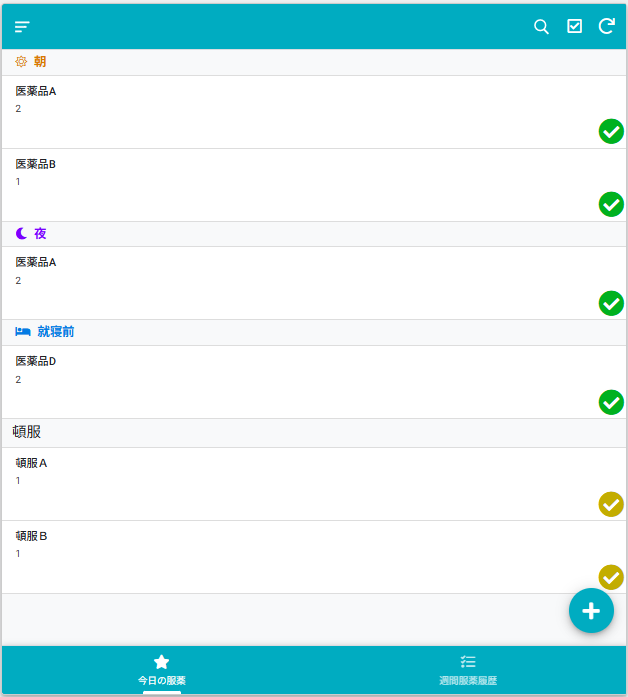                              | 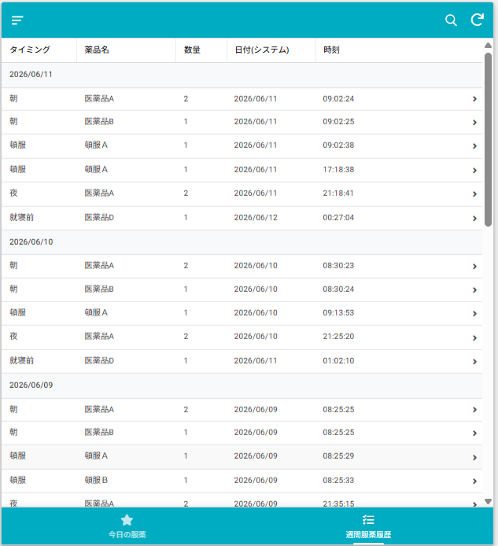 |
| 緑色のチェックボタン：定期服薬のため、1回のみ記録可能 黄色のチェックボタン：頓服のため、複数回記録可能 |                                                    |
|                                          新規服薬項目追加のみ可能                                          |                 服薬履歴の編集不可                 |
|                                           服薬項目詳細の表示可能                                           |               服薬履歴詳細の表示可能               |

|                       全ての服薬リスト                       |                    服薬状況                    |
| :----------------------------------------------------------: | :--------------------------------------------: |
|    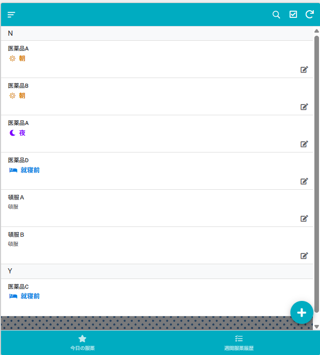    | 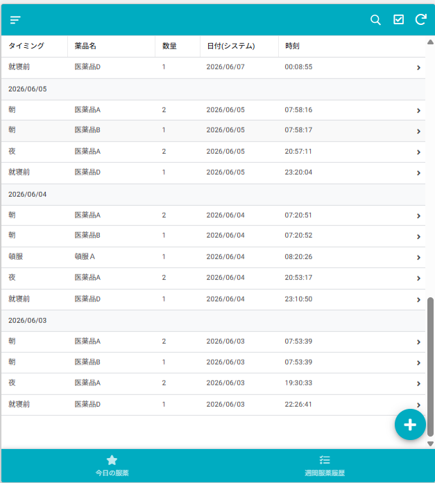 |
| No：服薬中止していないのグループ Yes：服薬中止のグループ |                                                |
|                     新規服薬項目追加可能                     |               服薬履歴の追加可能               |
|                    服薬項目詳細の表示可能                    |             服薬履歴詳細の表示可能             |
|              複数選択することで服薬項目削除可能              |       複数選択することで服薬履歴削除可能       |

|                    服薬項目詳細                    |                    服薬履歴詳細                    |
| :------------------------------------------------: | :------------------------------------------------: |
| 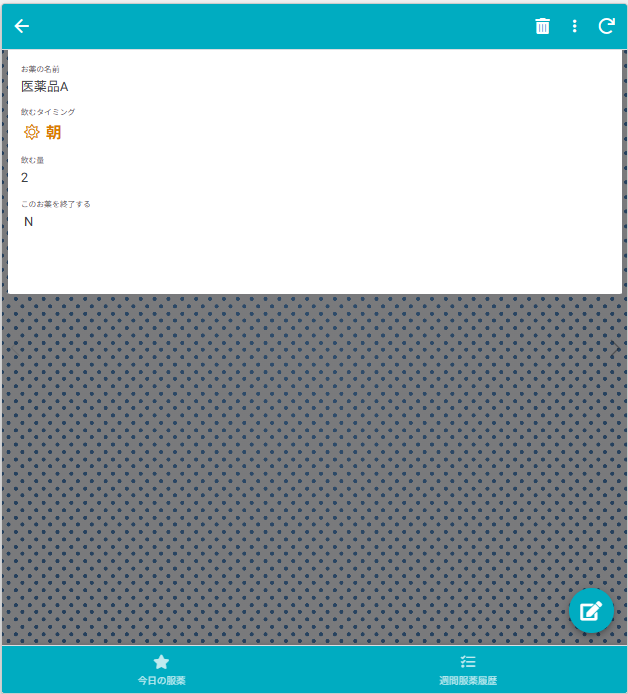 | 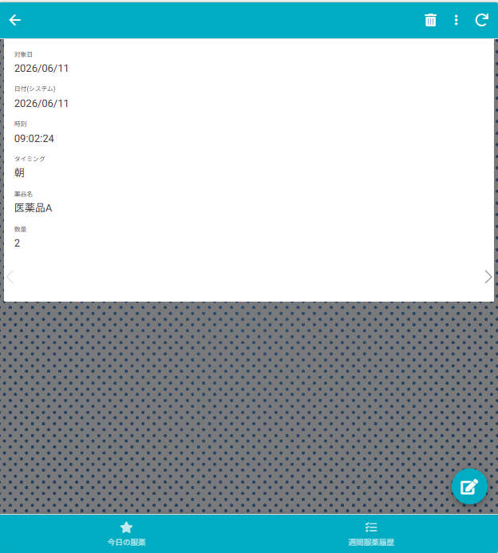 |

|                    服薬項目追加フォーム                    |                    服薬項目編集フォーム                    |
| :--------------------------------------------------------: | :--------------------------------------------------------: |
| 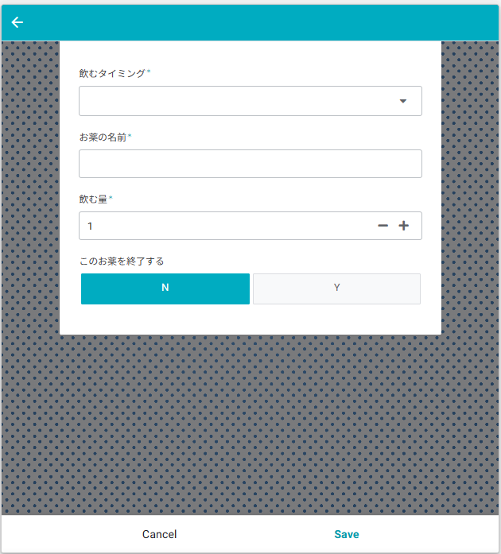 | 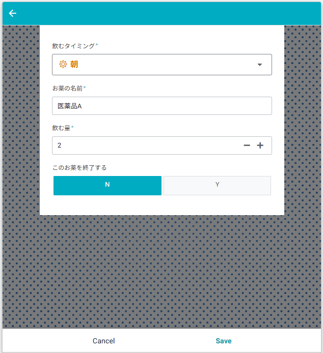 |

|                    服薬履歴追加フォーム                    |                    服薬履歴編集フォーム                    |
| :--------------------------------------------------------: | :--------------------------------------------------------: |
| 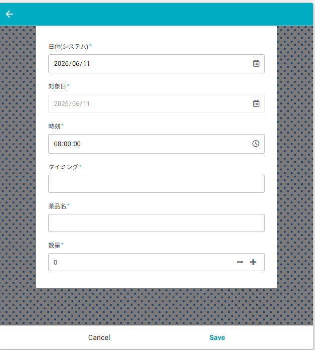 | 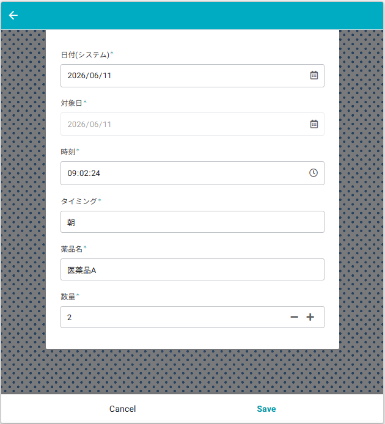 |

### どのように操作するのか

#### ■日常の操作

1. **アプリを開く**: 
   メイン画面に「今日飲むべき薬」だけがクリアに表示されます。
2. **完了を記録する**: 
   該当する薬のボタンを**ワンタップするだけ**で、現在のタイムスタンプが自動記録され、二重押しできない状態（タスク消し込み完了）になります。

#### ■服薬リスト登録・編集・削除

- **操作方法**: 
  サイドメニューの「全ての服薬リスト」から各薬の詳細を開き、追加・編集・削除を行います。
- **設計の意図**: 
  日常の画面から隔離することで、誤操作でマスターデータを書き換えてしまうリスクを防ぎます。

#### ■服薬履歴登録・編集・削除

- **操作方法**: 
  万が一記録を忘れたり、押し間違えたりした場合は、サイドメニューの「服薬状況」から過去のログを遡って手動で修正・追加します。
- **設計の意図**:  
  あえて「サイドメニューを開く」という**ちょっとした手間**を挟むことで、安易な後回しを防止しつつ、「いつでも綺麗なデータに修復できる」という完璧主義のための安心感を担保しています。

## 工夫したところ

独自アプリ化のメリットを限られたノーコードの枠組み（AppSheet）で実現するため、以下のようなビジネスロジックやデータ制御の工夫を施しています。

- **定期薬と頓服（とんぷく）の多重記録制御** 
  定期薬は1日1回しか記録できないようボタンの活性・非活性を制御（二重押し防止）する一方、頓服は1日に複数回記録できるよう、条件分岐によって挙動を切り分けるロジックを実装しました。
- **日付跨ぎ（就寝前）の時間判定ロジック** 
  「深夜1時に飲んだ薬は前日分として数えたい」という実感に合わせ、午前5時までの記録であればシステム上の日付を「前日」としてタイムスタンプを補正する判定ロジックを組み込みました。
- **「あえて手間を挟む」画面制御と情報量の制限** 
  日常のメイン画面からは編集機能を排して「当日・直近1週間」のデータのみにビュー（表示期間）を制限し、過去データの編集はサイドメニューの奥に隠した別ビューに分離。これにより、ユーザーの認知負荷を下げつつ「**最近どうだったのか**」に意識を誘導、安易な後回し行動をシステム側でコントロールしています。

## アプリ化した効果

- **記録をつけるための服薬** 
  記録をきれいに揃えたい「完璧主義」から服薬の後回しが減りました。 
  薬品名を確認しながらチェックをつけるので、飲み忘れも減りました。 
- **最近の状況に目が行くようになった** 
  履歴が溜まると達成感がありますが、基本画面では直近1週間に制御しているため、**最近**に意識が向きやすくなりました。 
  時刻の記録も行っているため、リズムの崩れも認知しやすくなりました。 
