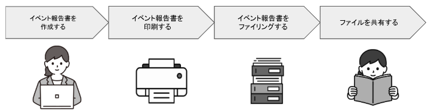
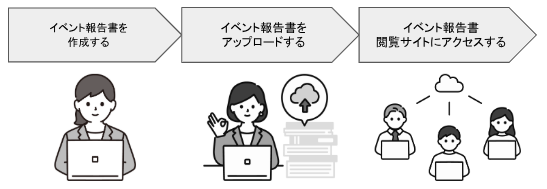
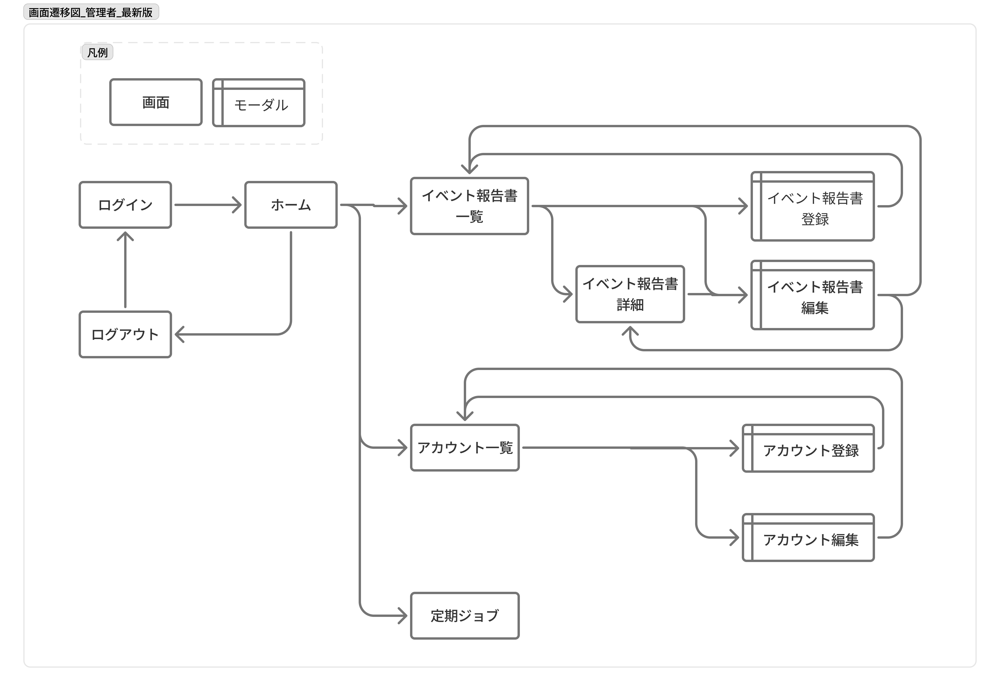
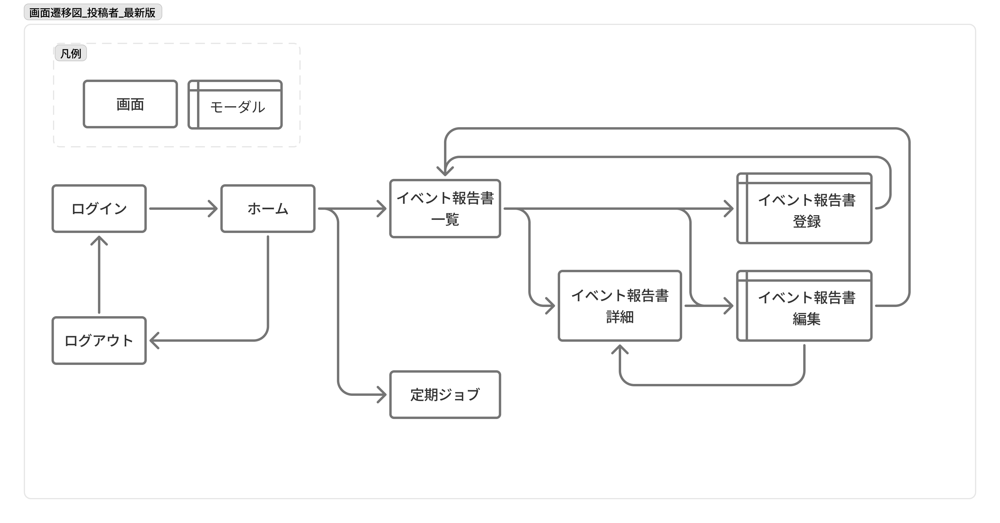
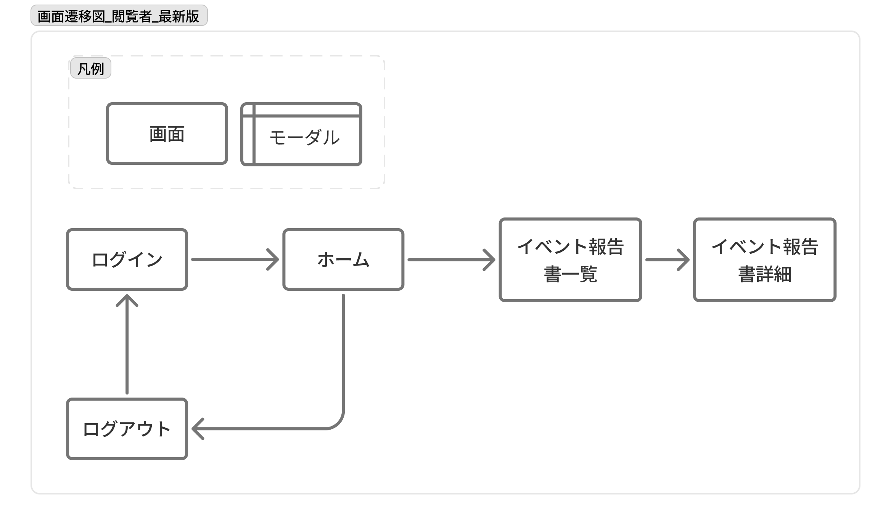

# 業務要件定義書

## システム化の目的

アナログなファイリング管理をデジタル化して、様々な場面で手軽な共有を実現する事。

### 【現行運用】

現在、イベント報告書は、紙媒体を印刷し・ファイリングをして管理・運用されている。

### 【次期運用】

イベント報告書をオンライン上で管理・運用できる仕様に変更を行う。

## システム概要

- 本システムは、イベント報告書の閲覧が可能な会員制サイトである。
- サイトの閲覧・投稿には、管理者アカウントより発行されたアカウントでログインする必要がある。

## ユーザーロール

本システムでは3種類のロールでアカウント管理を行っている。 
各ロールの種類と役割は以下の通りである。 

|  #  | ユーザー | 役割                                                                                                                             |
| :-: | :------: | :------------------------------------------------------------------------------------------------------------------------------- |
|  1  |  管理者  | アカウント管理（作成、編集、削除）ができる イベント報告書の投稿管理（作成・編集・削除）ができる 定期ジョブの実行ができる |
|  2  |  投稿者  | イベント報告書の投稿管理（作成・編集・削除）ができる 定期ジョブの実行ができる                                                |
|  3  |  閲覧者  | 公開されているイベント報告書の閲覧ができる                                                                                       |

## 機能一覧

|  #  |      分類      | 機能                                         | 管理者 | 投稿者 | 閲覧者 |
| :-: | :------------: | :------------------------------------------- | :----: | :----: | :----: |
|  1  |      認証      | ログインする                                 |   ○    |   ○    |   ○    |
|  2  |                | ログアウトする                               |   ○    |   ○    |   ○    |
|  3  |   アカウント   | アカウントを登録する                         |   ○    |   ー   |   ー   |
|  4  |                | アカウント情報を更新する                     |   ○    |   ー   |   ー   |
|  5  |                | アカウントを削除する                         |   ○    |   ー   |   ー   |
|  6  |                | アカウント一覧を取得する                     |   ○    |   ー   |   ー   |
|  7  |                | アカウント詳細を取得する                     |   ○    |   ー   |   ー   |
|  8  | イベント報告書 | イベント報告書を登録する                     |   ○    |   ○    |   ー   |
|  9  |                | イベント報告書を更新する                     |   ○    |   ○    |   ー   |
| 10  |                | イベント報告書を削除する                     |   ○    |   ○    |   ー   |
| 11  |                | イベント報告書一覧を表示する                 |   ○    |   ○    |   ○    |
| 12  |                | イベント報告書詳細を表示する                 |   ○    |   ○    |   ○    |
| 13  |     ジョブ     | (月次ジョブ)公開終了日を過ぎた投稿を削除する |   ○    |   ○    |   ー   |

## 画面一覧

| ＃  | ロール |  ドメイン  |       画面名       | 説明                                   | 主な要素                                                                                                                                                                 |
| :-: | :----: | :--------: | :----------------: | :------------------------------------- | :----------------------------------------------------------------------------------------------------------------------------------------------------------------------- |
|  1  | 管理者 |  ログイン  |      ログイン      | ログインフォームからのログインを行う   | 入力フォーム（アカウントID、パスワード）、ログインボタン                                                                                                                 |
|  2  |        |            |     ログアウト     | ログアウト後に表示する                 | ログイン画面に戻るボタン                                                                                                                                                 |
|  3  |        |   ホーム   |       ホーム       | ログイン時に表示するデフォルト画面     | サイドメニュー（イベント報告書、アカウント、ジョブ、ログアウト）、メインメニュー（イベント報告書、アカウント、ジョブ）                                                   |
|  4  |        |    投稿    | イベント報告書一覧 | 投稿一覧を表示する                     | レコード（イベント実施日、イベント名、最終更新日、削除ボタン、編集ボタン）、新規作成ボタン                                                                               |
|  5  |        |            | イベント報告書詳細 | 投稿詳細を表示する                     | タイトル、イベント実施日、PDFプレビュー、削除ボタン、編集ボタン                                                                                                          |
|  6  |        |            | イベント報告書登録 | 新規投稿の作成フォームを表示する       | タイトル、閉じるボタン、登録フォーム（イベント名、イベント実施日、イベント報告書PDF、PDFアップロードボタン）、PDFプレビュー、更新ボタン                                  |
|  7  |        |            | イベント報告書編集 | 既存投稿の変更フォームを表示する       | タイトル、閉じるボタン、編集フォーム（イベント名、イベント実施日、イベント報告書PDF、PDFアップロードボタン）、登録中ファイル名、PDF削除ボタン、PDFプレビュー、更新ボタン |
|  8  |        | アカウント |   アカウント一覧   | アカウント一覧を表示する               | レコード（アカウント名、ログインID、ロール、削除ボタン、編集ボタン）、新規作成ボタン                                                                                     |
|  9  |        |            |   アカウント登録   | 新規アカウント作成フォームを表示する   | タイトル、閉じるボタン、登録フォーム（ログインID、アカウント名、ロール、パスワード）、登録ボタン                                                                         |
| 10  |        |            |   アカウント編集   | 既存アカウントの編集フォームを表示する | タイトル、閉じるボタン、編集フォーム（ログインID、アカウント名、ロール、パスワード）、登録ボタン                                                                         |
| 11  |        |   ジョブ   |     定期ジョブ     | ジョブ実行ボタンを表示する             | タイトル、月次ジョブ実行ボタン                                                                                                                                           |
| 12  | 投稿者 |  ログイン  |      ログイン      | ログインフォームからのログインを行う   | 入力フォーム（アカウントID、パスワード）、ログインボタン                                                                                                                 |
| 13  |        |            |     ログアウト     | ログアウト後に表示する                 | ログイン画面に戻るボタン                                                                                                                                                 |
| 14  |        |   ホーム   |       ホーム       | ログイン時に表示するデフォルト画面     | サイドメニュー（イベント報告書、ジョブ、ログアウト）、メインメニュー（イベント報告書、ジョブ）                                                                           |
| 15  |        |    投稿    |      投稿一覧      | 投稿一覧を表示する                     | レコード（イベント実施日、イベント名、最終更新日、削除ボタン、編集ボタン）、新規作成ボタン                                                                               |
| 16  |        |            |      投稿詳細      | 投稿詳細を表示する                     | タイトル、イベント実施日、PDFプレビュー、削除ボタン、編集ボタン                                                                                                          |
| 17  |        |            |      投稿登録      | 新規投稿の作成フォームを表示する       | タイトル、閉じるボタン、登録フォーム（イベント名、イベント実施日、イベント報告書PDF、PDFアップロードボタン）、PDFプレビュー、更新ボタン                                  |
| 18  |        |            |      投稿編集      | 既存投稿の変更フォームを表示する       | タイトル、閉じるボタン、編集フォーム（イベント名、イベント実施日、イベント報告書PDF、PDFアップロードボタン）、登録中ファイル名、PDF削除ボタン、PDFプレビュー、更新ボタン |
| 19  |        |   ジョブ   |     定期ジョブ     | ジョブ実行ボタンを表示する             | タイトル、月次ジョブ実行ボタン                                                                                                                                           |
| 20  | 閲覧者 |  ログイン  |      ログイン      | ログインフォームからのログインを行う   | 入力フォーム（アカウントID、パスワード）、ログインボタン                                                                                                                 |
| 21  |        |            |     ログアウト     | ログアウト後に表示する                 | ログイン画面に戻るボタン                                                                                                                                                 |
| 22  |        |   ホーム   |       ホーム       | ログイン時に表示するデフォルト画面     | サイドメニュー（イベント報告書、ログアウト）、メインメニュー（イベント報告書）                                                                                           |
| 23  |        |    投稿    |      投稿一覧      | 投稿一覧を表示する                     | レコード（イベント実施日、イベント名、最終更新日）                                                                                                                       |
| 24  |        |            |      投稿詳細      | 投稿詳細を表示する                     | タイトル、イベント実施日、PDFプレビュー                                                                                                                                  |

## 画面遷移図

### 管理者

### 投稿者

### 閲覧者

