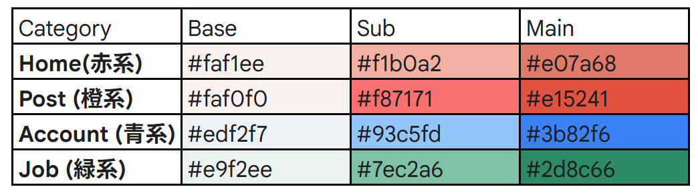
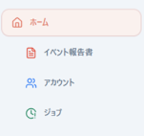
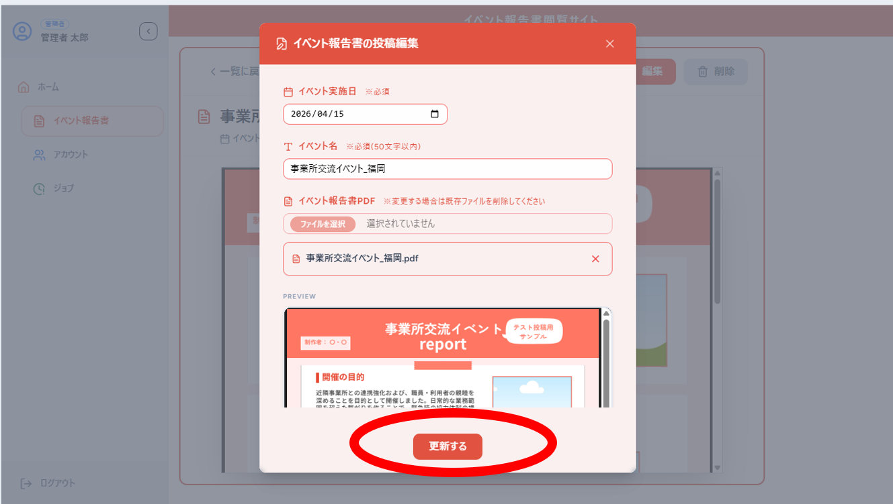
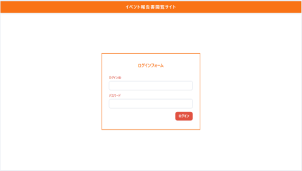
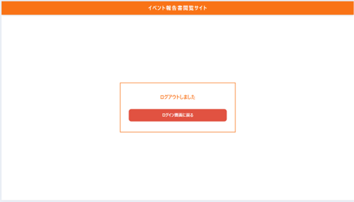
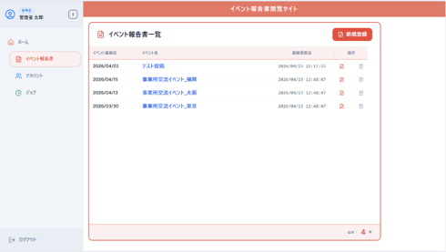
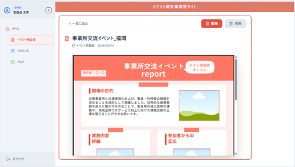
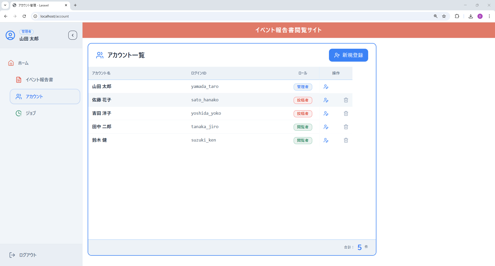
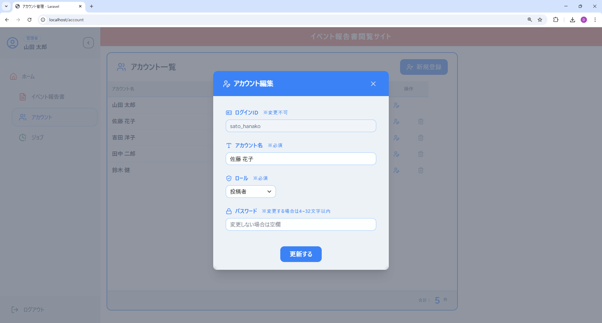

# イベント報告書閲覧サイト

## プロジェクト概要

福祉事業所で主催しているイベント実施後に作成される「イベント報告書」を会員制webサイトで閲覧管理を行うシステム開発プロジェクト 

## プロジェクト誕生の背景

定期的に開催されるイベントに対して、Canvaを用いてA4サイズ1枚のイベント報告書が作成されています。 
クリアポケットのファイリング管理をデジタル化して、外出先でも手軽に紹介できるツールが合ったらいいな。 
そんな「あったらいいな」をBackendはPHPフレームワークLaravel、FrontendはフレームワークReactを用いて形にしました。 

## 使用技術

|     技術     |    言語    | フレームワーク |
| :----------: | :--------: | :------------: |
|   Backend    |    PHP     |   Laravel12    |
|   Frontend   | JavaScript |     React      |
| データベース |   Mysql    |       -        |

## 主要機能

|      ドメイン      | 主な機能                             |
| :----------------: | :----------------------------------- |
|        認証        | ログイン、ログアウト                 |
| イベント報告書管理 | 一覧取得、詳細取得、登録、編集、削除 |
|   アカウント管理   | 一覧取得、登録、編集、削除           |
|     月次ジョブ     | 公開期限切れ投稿の削除               |

## 制作のこだわりポイント

|   #   | ポイント                             | 説明                                                                                                                                                                                          |                        画像                        |
| :---: | :----------------------------------- | :-------------------------------------------------------------------------------------------------------------------------------------------------------------------------------------------- | :------------------------------------------------: |
| **1** | 落ち着いたベースから                 | 項目ごとに色分けしつつも「Base、Sub、Main」で濃さを固定 状況に応じて透明度を調整してバランスよく配色                                                                                      |  |
| **2** | 直感的にわかるUI設計                 | アイコンのみの表示でも意味を理解しやすい設計 サイドバーを折りたたむとアイコンのみの表示にもなります                                                                                       |     |
| **3** | 重要な操作ボタンは常に表示するUI設計 | スクロースしないと見えない「登録する」ボタンなど直感的にでも操作できるように視界に入るように設計。 入力不備はバリデーションメッセージで何を修正したらいいのか具体化する設計を行いました。 |   |

## 画面イメージ

|                     ログイン                      |                     ログアウト                     |
| :-----------------------------------------------: | :------------------------------------------------: |
|  |  |

|                イベント報告書一覧                 |                イベント報告書詳細                |
| :-----------------------------------------------: | :----------------------------------------------: |
|  |  |

|                      アカウント一覧                      |                  アカウント編集モーダル                   |
| :------------------------------------------------------: | :-------------------------------------------------------: |
|  |  |

## ドキュメント

- [業務要件定義書](./Business-Requirements-Document.md)
- 技術支援（チーム開発用資料）
  - [環境構築手引き](./setup-guide.md)
  - [GitHub運用ガイド](./github-guide.md)
