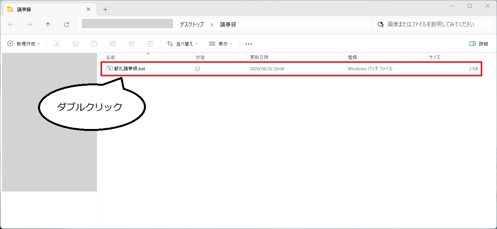
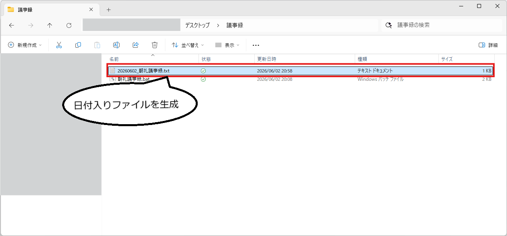
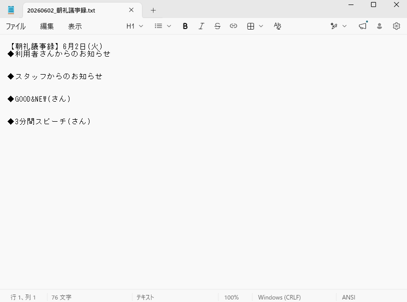
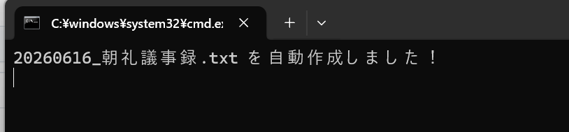

# 議事録テンプレート自動生成ツール

## 開発のきっかけ

- 手動コピーの手間を削減したかった
  - 過去の議事録ファイルをコピーだと、不要な文字の削除が手間でした
  - テンプレートファイルをコピーだと、日付の差し替えが手間でした

  > 定型的な「地味に面倒な作業」は忘れると、書類の信用を失いかけてしまう。<br>
  > 慎重に忘れないようにすることで、「心理的ストレス」にもつながっていました。

- 急な議事録担当も率先してできるハイパフォーマンス
  - 突発的な指名にも落ち着いて対応することができる安心感
  - 率先してタスクを引き受けられる環境づくり

  > 「瞬間的な準備」がもたらす効果が大きいと感じ、自動化に踏み切りました。

## 技術選定の理由

### 🎯 様々技術がある中でバッチファイル化を選択した理由

> - **最速・最小の手間で完結する操作性**<br>
>   複雑なツールを立ち上げる必要がなく、デスクトップ等から「ダブルクリックするだけ」で誰もが1秒で実行できる利便性を最優先しました。
> - **要件に対する最適なシンプルさ**<br>
>   今回の目的である「定型文や日付の自動生成」に対して、過剰なプログラミング言語やサーバー環境を用いず、必要最小限のロジックで実装可能と判断しました。
> - **完全なノン・インストール環境での動作**<br>
>   PCのデフォルト機能（標準コマンド）のみで動作するため、新しいソフトのインストールが制限されがちな業務環境でも、即座に安全に導入できる強みがあります。

### 💡 補足資料：バッチファイルの仕組みと作成手順

<details>
  <summary><span style="font-size: 1.17em; font-weight: bold;">⚙️ バッチファイルとは（自動化の仕組み）</span></summary>
  <br>

> PC上で行う決まったルーティン作業を、まとめて順番に実行してくれるファイルです。

- **記述ルール** ➔ `コマンド` と呼ばれる専用の書式（呪文のような指示）をひとまとめに記述
- **役割** ➔ 人間が手動で行う「コピー」「移動」「リネーム」などの作業をPCに代理で自動実行

</details>

<details>
  <summary><span style="font-size: 1.17em; font-weight: bold;">🚀 バッチファイル（.bat）の作成・実行手順</span></summary>
  <br>

Windows環境で安全かつ確実に動くバッチファイルを作成するための、基本のステップです。

### 1. 📝 テキストエディタでコマンドを書き出す

メモ帳やVS Codeなどのテキストエディタを開き、PCに実行させたい`コマンド`（指示）を記述します。

> 💡 **最初の1行のポイント**
> 先頭に `@echo off` と書いておくと、実行時に黒い画面に余計なコマンドの文字列が表示されず、スッキリした見た目になります。

### 2. 💾 適切な設定でファイルを保存する

ここが一番重要なロジックです。Windowsのシステムに合わせて以下の3つの設定で保存します。

- **拡張子** ➔ `.txt` から **`.bat`** に変更（例：`backup-tool.bat`）
- **文字コード** ➔ **`ANSI`** （または `Shift-JIS` / `CP932`）
  - _※UTF-8で保存すると、日本語が黒い画面で文字化けする原因になります_
- **改行コード** ➔ **`CRLF`** （Windows標準の改行形式）

### 3. 📂 任意のフォルダに配置して実行する

作成したバッチファイルを動かしたいディレクトリ（フォルダ）に配置します。

- **実行方法** ➔ ファイルを**ダブルクリック**するだけで、記述された指示が上から順番に自動実行されます。
- **確認方法** ➔ もし一瞬で黒い画面が消えて結果が見えない場合は、コマンドの最後に `pause` と書いておくと、キーを押すまで画面を止めておくことができます。

</details>

## 日常的な操作手順

例）朝礼議事録.bat

<details>
    <summary> <b>📸【バッチ実行前】</b></summary>
    <br>
    
 </details>

<details>
    <summary> <b>📸【バッチ実行後】バッチ実行前】</b></summary>
    <br>
    
 </details>

<details>
    <summary> <b>📸【自動生成されたテキストファイル】</b></summary>
    <br>
    
 </details>

## 実装におけるこだわり

- 作成完了のお知らせ
  > バッチファイルだけでは、動作を裏側で行われているので、変化に気づきにくい側面があります。</br>
  > だからこそ、処理結果をコマンドプロンプト（黒い画面）を表示して安心感を担保</br>
- 外部APIを用いない数学を用いた曜日の算出
  > 曜日を算出する方法を調べる中で、数式でも算出可能だと知り、導入しました。</br>
  > 不用意にAPIを導入する必要もなく、手作業で修正する必要もないことが最大のメリットと感じています。</br>
- ファイル名には0埋めした8桁の日付、本文には0抜きした見やすい日付
  > PCによって日付の表示形式は様々です。その変動を吸収してどのような端末でも使えるように広い視点を持って実装を行いました。</br>
  > そしてファイル名は規則的に桁数が揃っている方が見た目が良いが、本文は0抜きの方が読みやすさがあるので、その両立を図るロジックを組み込みました。</br>

## ソースコード解説

### 1.画面表示設定

```
@echo off
setlocal enabledelayedexpansion
```

- `@echo off`：実行するときに、背景の黒い画面に余計なプログラムの文字（コマンド自体）を表示しないように隠す設定
- `setlocal enabledelayedexpansion`：バッチファイルの中で変数をリアルタイムに正しく処理する特殊な設定

### 2.日付の数字を分解して並び替え

PCによって、今日の日付が `2026/05/21`だったり`2026-05-21`だったり形式が違います。<br>
その為の差分を吸収する処理。<br>

```
for /f "tokens=1-3 delims=-/ " %%a in ("%date%") do (
    set "VAL1=%%a"
    set "VAL2=%%b"
    set "VAL3=%%c"
)
```

- `%date%`：今日の日付を、スラッシュ`/`やハイフン`-`で**3つ**に切り分ける。
- 切り分けた結果を、いったん VAL1（1個目）、VAL2（2個目）、VAL3（3個目）という変数に格納。

```
if "%VAL1:~0,2%"=="20" (
    set "Y=%VAL1%" & set "M=%VAL2%" & set "D=%VAL3%"
) else (
    set "Y=%VAL3%" & set "M=%VAL1%" & set "D=%VAL2%"
)
```

- 1個目の文字（VAL1）が「20（西暦）」から始まっているか確認
  - **「20」から始まる場合（例: 2026/05/21）**：そのまま Y＝年(2026)、M＝月(05)、D＝日(21) に変換。
  - **そうじゃない場合（例: 05-21-2026 のような並びの場合）**：順番を入れ替えて、正しく年・月・日になるように調整して変換

### 3.月と日の「0」を消す処理

```
if "%M:~0,1%"=="0" set "M=%M:~1%"
if "%D:~0,1%"=="0" set "D=%D:~1%"
```

- 議事録の見出し用に「05月01日」を「5月1日」にするための加工

### 4.ファイル名用に「0」を付け直す処理

```
set "MM=0%M%" & set "MM=!MM:~-2!"
set "DD=0%D%" & set "DD=!DD:~-2!"
set "FILENAME_DATE=%Y%%MM%%DD%"
```

- ファイル名用の8桁日付（yyyymmdd）を作成

### 5.曜日を計算する（ツェラーの公式）

バッチファイル単体で曜日を割り出す「数学の公式（ツェラーの公式）」を動かす。<br>

```
set /a "ty=%Y%", "tm=%M%", "td=%D%"
if %tm% leq 2 (set /a "ty-=1", "tm+=12")
set /a "w=(ty + ty/4 - ty/100 + ty/400 + (13*tm+8)/5 + td) %% 7"
```

- 最終的に`w`の中に**0〜6の数字**が入る。

```
if %w%==0 set "W=日"
if %w%==1 set "W=月"
if %w%==2 set "W=火"
if %w%==3 set "W=水"
if %w%==4 set "W=木"
if %w%==5 set "w=金"
if %w%==6 set "W=土"
```

- 数字を曜日に変換する。

### 6.ファイルの作成

```
set "MY_FILE=%FILENAME_DATE%_朝礼議事録.txt"
```

- ファイル名に生成してファイルを作成（例：`20260521_朝礼議事録.txt`）

```
echo 【朝礼議事録】%M%月%D%日(%W%)> "%MY_FILE%"
echo ◆利用者さんからのお知らせ>> "%MY_FILE%"
echo.>> "%MY_FILE%"
echo.>> "%MY_FILE%"
echo ◆スタッフからのお知らせ>> "%MY_FILE%"
echo.>> "%MY_FILE%"
echo.>> "%MY_FILE%"
echo ◆GOOD^&NEW(さん)>> "%MY_FILE%"
echo.>> "%MY_FILE%"
echo.>> "%MY_FILE%"
echo ◆3分間スピーチ(さん)>> "%MY_FILE%"
echo.>> "%MY_FILE%"
```

- ファイル本文の書き出し。

### 7.終了処理

```
echo %MY_FILE% を自動作成しました！
timeout /t 2 > nul
```

- 黒い画面に「作成しました！」と表示する
- `timeout /t 2 > nul`：2秒間だけ画面をそのままキープ<br>
  
