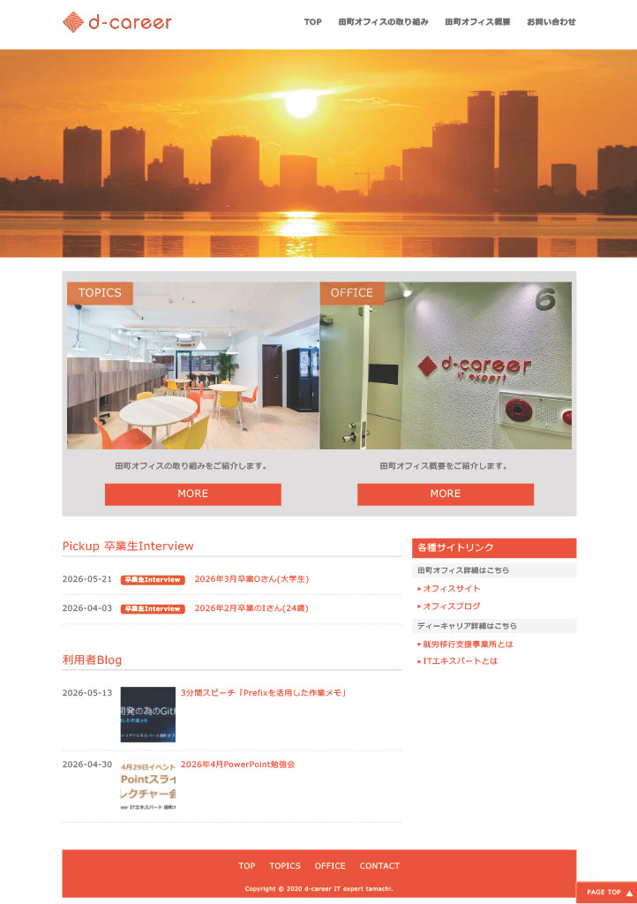
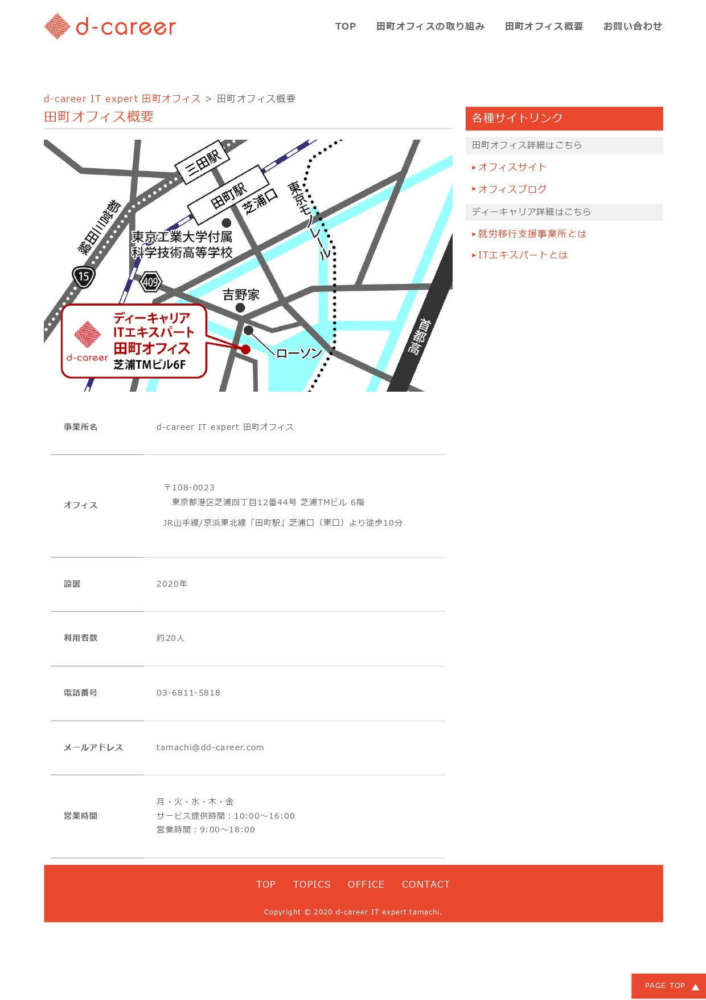
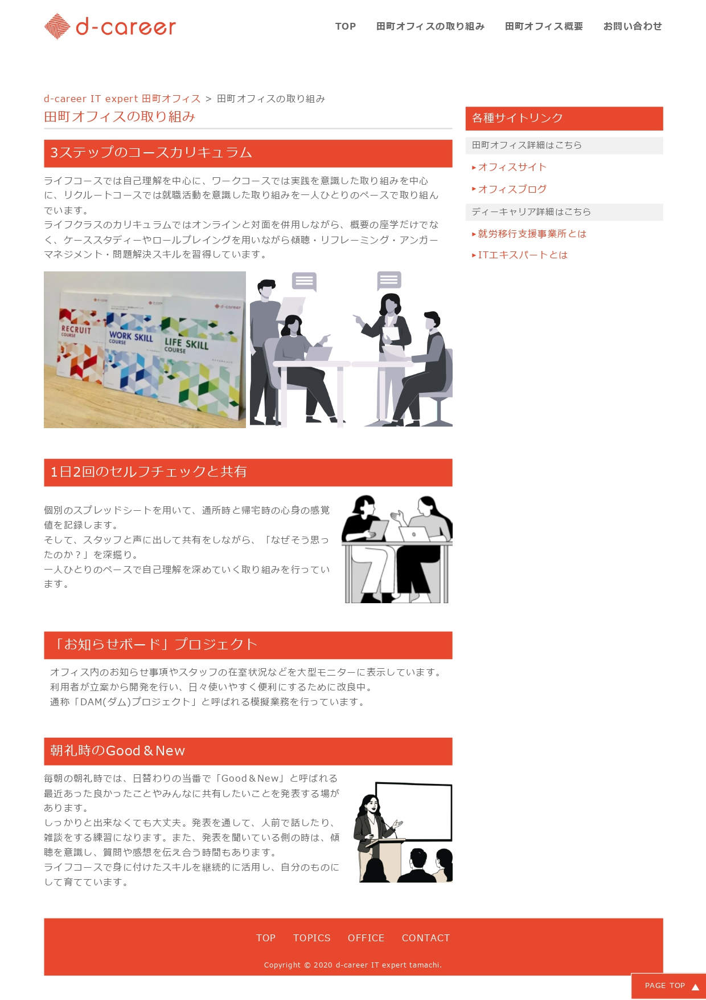
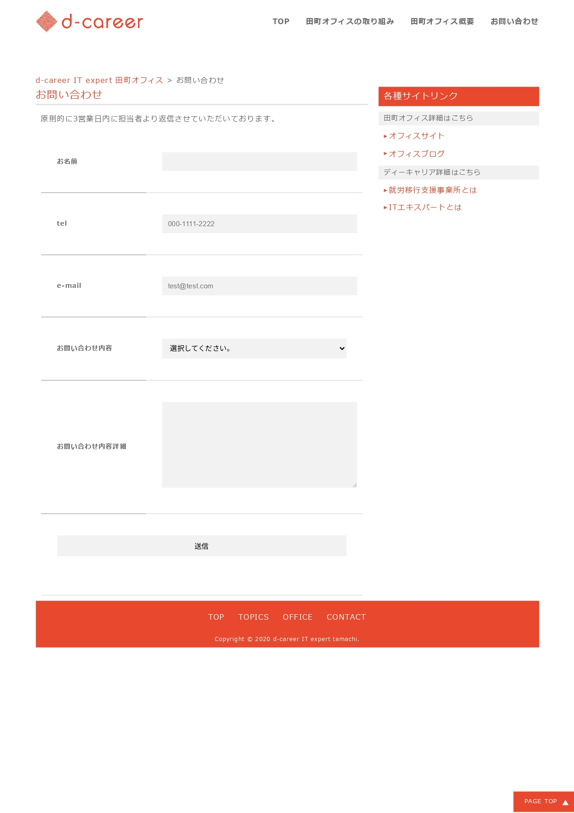
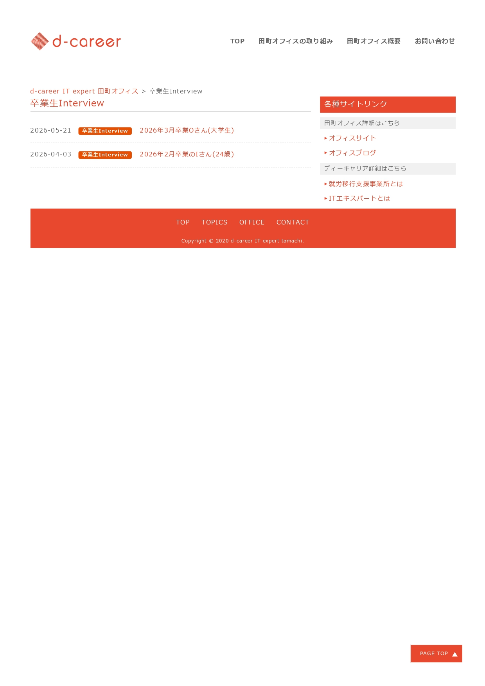
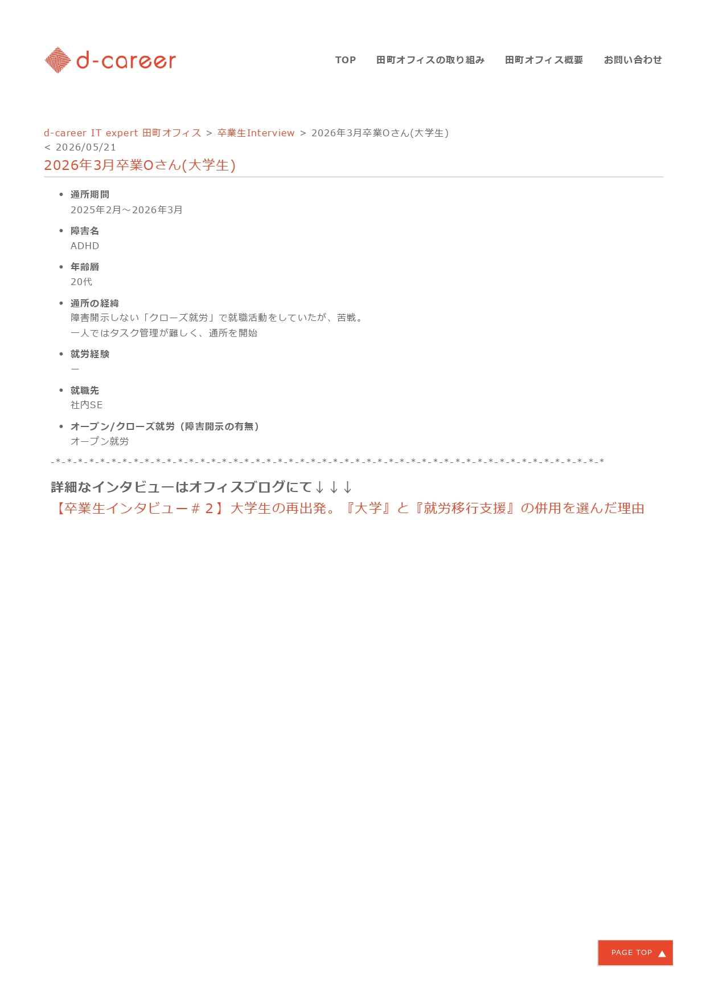
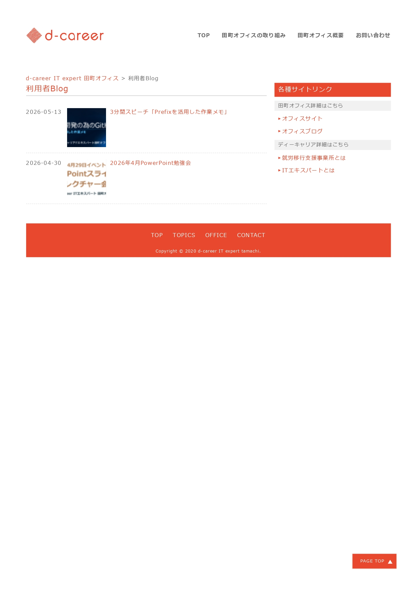
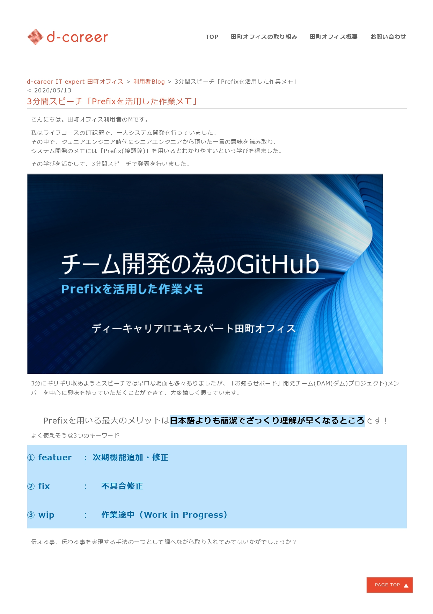

# オフィス紹介サイト

## 制作のきっかけ

WordPressの学習をしている時に、何か作ってみたいけど何を作ろうか迷っていました。 
その時に、身近にいた就労移行支援事業所のスタッフさんに「最近、これ欲しいなって思うサイトってありませんか？」と尋ねてみました。 
その際に「**就労移行支援事業所の営業資料として、就労継続支援A型・B型事業所やクリニックから認知してもらい利用者紹介に繋げるためのサイトがあったらいいな**」というアイディアを頂きました。 
現在運用中のサイトを分析して、何が足りないのか、どんな情報が付加されていると魅力的になるのかを調べながら制作が始まりました。 

## サイトコンセプト

サイトを制作するにあたり、以下の事を大切にしました。 
「**リアルな声をお届けするわかりやすいサイト制作**」 

## 💻 使用技術・開発環境

### フロントエンド / バックエンド

- **HTML5 / CSS3**
- **PHP** (WordPressのテンプレート階層に準拠したテーマ開発)
- **WordPress** (CMS構築・カスタムフィールド拡張)

### 主要プラグイン

| プラグイン名                     | 導入目的・用途                                                             |
| :------------------------------- | :------------------------------------------------------------------------- |
| **Show Current Template**        | 開発効率化（現在適用されているテンプレートファイルの可視化）               |
| **Breadcrumb NavXT**             | ユーザーのナビゲーション向上（パンくずリストの自動生成・全ページ共通配置） |
| **WP-PageNavi**                  | ページネーションの実装（過去ログや一覧の視覚的なページ切り替え）           |
| **Advanced Custom Fields (ACF)** | 管理画面のカスタマイズ（卒業生インタビュー等の構造化データの入力）         |
| **Contact Form 7**               | お問い合わせフォームの構築（事業所独自の項目カスタマイズ）                 |

### インフラ・開発ツール

- **FTPクライアント:** FileZilla（本番環境へのファイル転送・反映）
- **開発環境:** Visual Studio Code (VS Code)
- **バージョン管理:** GitHub

---

## 📄 ページ構成・サイト構造

Webサイト全体の情報設計は以下の通りです。ユーザーが迷わず目的の情報（強み、インタビュー、問い合わせ）にアクセスできるよう、動線を最適化しています。

- **トップ画面（Home）**
  - サイトの顔として、事業所のビジョンや最新情報を集約
- **独自の取り組み・強み紹介**
  - 他事業所との差別化ポイントをアピール
- **卒業生インタビュー（一覧・詳細）**
  - 要約情報を添えた、すばやい情報収集が可能なブログ型コンテンツ
- **利用者ブログ（活動配信）**
  - 未利用者が利用開始後のイメージを具体的に持てる体験談配信の場
- **お問い合わせ（Contact）**
  - 事業所の特性に合わせたカスタムフォーム

---

## 📸 画面イメージ・機能紹介

本サイトの実際の画面構成と、それぞれの役割・実装のこだわりです。

### 🏠 メイン・固定ページ

|                     画面イメージ                     | ページ名 / ファイル名      | 実装のポイント・こだわり                                                                                                 |
| :--------------------------------------------------: | :------------------------- | :----------------------------------------------------------------------------------------------------------------------- |
|       | **トップ画面**             | サイトの顔として、事業所のビジョンや最新情報を集約。各コンテンツへのスムーズな導線を設計しています。                     |
|     | **田町オフィス概要**       | 事業所の基本情報やアクセス、施設の雰囲気をクリアに伝えるための固定ページです。                                           |
|  | **田町オフィスの取り組み** | 利用者視点に立ち、他事業所にはない独自の取り組みをピックアップ。文章とイメージ画像を併用して視覚的にアピールしています。 |
|   | **お問い合わせ**           | `Contact Form 7` を使用。就労移行支援事業所ならではの相談カテゴリーやステータスに項目を細かくカスタマイズしています。    |

---

---

### 🎓 卒業生インタビュー（カスタム構造）

文章量が多く埋もれがちだった既存のインタビューを、要約（サマリー）と詳細の2ステップに分けることで、紹介元がすばやく情報収集できるように工夫しました。

#### ■ 一覧画面

項目を絞った「要約一覧」をタイル状またはブログ形式で表示。一目で卒業生の活躍のエッセンスが掴めるように設計しています。
 

#### ■ 詳細画面

各卒業生のストーリーを深掘り。まずは要約で概要を伝えた上で、さらに詳しい背景は公式ブログへと繋げるスムーズなリンク導線を設けています。
 

---

### ✍️ 利用者ブログ（当事者目線の配信）

まだ利用していない人が「通い始めたら自分はどう変わるのか」をリアルに追体験し、一歩を踏み出す動機づけとなるためのコンテンツコーナーです。

#### ■ 一覧画面

活動内容や訓練の様子がリアルタイムに伝わる一覧画面。`WP-PageNavi` による視覚的なページネーションを実装しています。
 

#### ■ 詳細画面

（例：3分間スピーチ「Prefixを活用した作業メモ」など）
日々の具体的なアウトプットや学びを掲載。実際の訓練内容の質の高さをロジカルに証明する役割を果たします。
 

---

## ✨ 工夫したところ（ビジネスロジックとデザインのこだわり）

### 1. 卒業生インタビューの要約化と導線設計

既存のインタビューブログは文章量が多く、他の一般的なブログ記事に埋もれてしまいがちで、「すばやく情報収集する」という点において課題がありました。

- **対策:** 重要な項目を絞って**「要約一覧（サマリー）」**をトップや一覧に添える工夫を行いました。まずは一目でエッセンスを掴んでもらい、より詳しいストーリーを読みたい人に対して公式ブログへのリンクを設けることで、認知と詳細理解をスムーズに両立させています。

### 2. 利用者視点に基づく「他事業所との差別化」の強調

紹介元（クリニックや他のA型・B型事業所）に対して、本事業所ならではの強みをロジカルに伝えるための見せ方を工夫しました。

- **対策:** 実際に通う「利用者視点」で魅力に感じる独自の取り組みを厳選してピックアップ。テキストだけでなく**イメージ画像を効果的に併用**することで、視覚的・直感的にアピールできる設計にしています。

### 3. 動機づけのための「利用者ブログ」の開設

まだ事業所を利用していない人（当事者）が、「通い始めたら自分はどう変わるのか」「どのような経験や学びが得られるのか」をリアルに追体験できる場として、利用者による情報配信コーナーを追加しました。

### 4. 就労移行支援に特化した「お問い合わせ項目」の最適化

`Contact Form 7` のデフォルト項目にとどまらず、フォーム内のカテゴリー（相談内容やステータスなど）を**就労移行支援事業所ならではの項目**へと細かくカスタマイズ。紹介元や相談者が迷わず正確にコンタクトを取れるように配慮しています。

---

## ⏱ 制作実績・プロセス

- **学習時間:** 計 4 時間
- **制作時間:** 計 12 時間
- **成果:** 課題抽出からプラグイン選定、WordPressを用いた独自のカスタムテーマ構築までを一貫して実施。
