# 学習レポート共有サイト

## プロジェクト概要

## プロジェクト誕生の背景

## 使用技術

## 主要機能

## 制作のこだわり

**「UI」にこだわり、「ユーザー体験(UX)」を高める事意識してwebサイトを構成・デザインしてきました。** 
|#|ポイント|説明|画像|
|:---:|:---|:---|:---|
|**1**|迷わないフォームの注釈情報|登録・編集フォームは、注釈やプレースホルダを活用して、入力のルールや例示を表示。 どんなルールで何を入力したらいいのかわかりやすく丁寧に表現|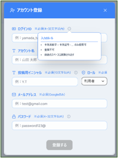|
|**2**|自作のタグのマルチセレクトメニュー|既存のデフォルトメニューでは解決できなかったので、コンポーネントを自作しました。 誤操作を防ぐ数量制限や視覚的なわかりやすさも追求したデザインです。|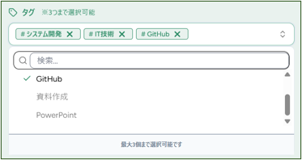|
|**3**|タグ一覧の使用状況を視覚化|タグの作成・削除・編集は一般権限で可能な仕様の為、誤操作を防ぐための工夫を盛り込みました。 ボタンにカーソルを当てると状況を表示し省スペースで情報提示できる仕組みを導入しました。|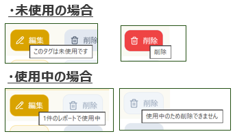|

## 画面イメージ

|                  ホーム画面（支援員）                  |                 ホーム画面（利用者）                  |
| :----------------------------------------------------: | :---------------------------------------------------: |
| 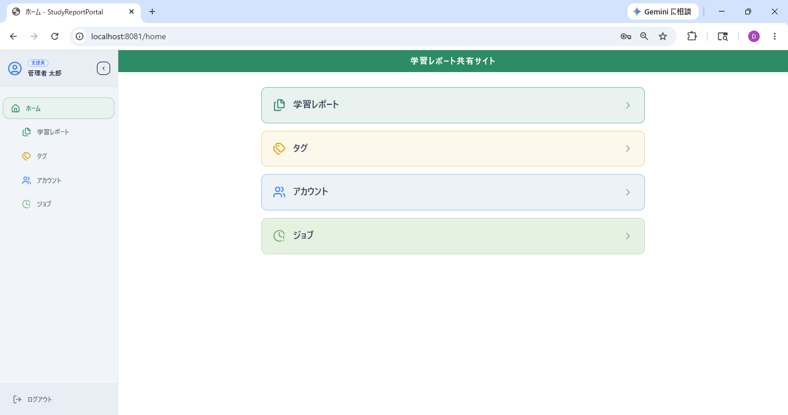 | 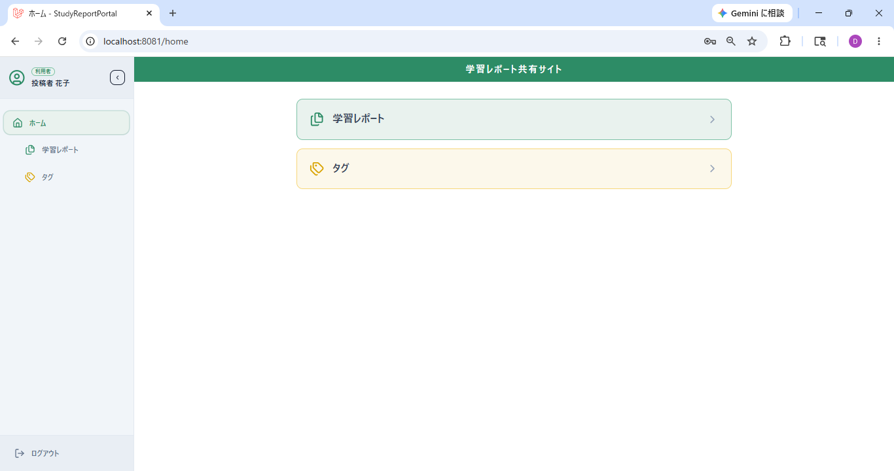 |

|                    学習レポート一覧                    |               学習レポート登録モーダル                |
| :----------------------------------------------------: | :---------------------------------------------------: |
| 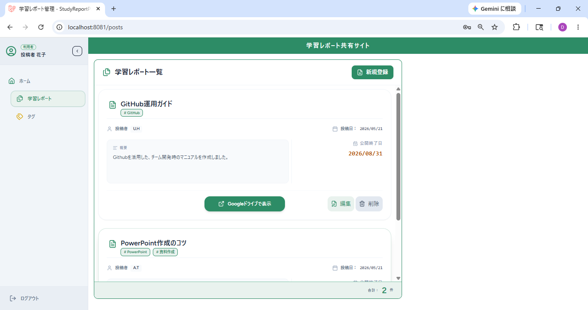 | 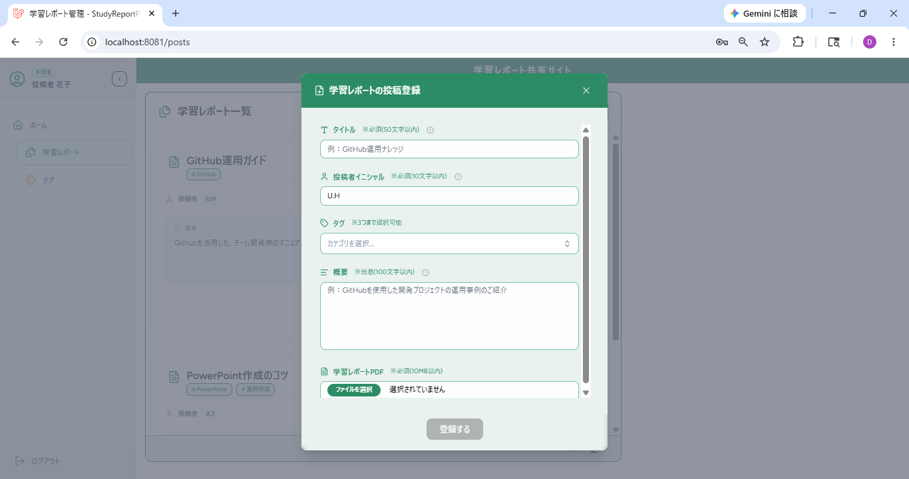 |

|                       タグ一覧                        |                    タグ編集モーダル                    |
| :---------------------------------------------------: | :----------------------------------------------------: |
| 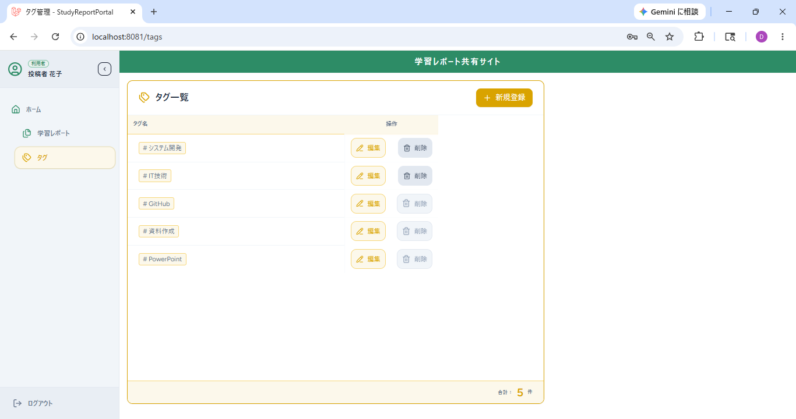 | 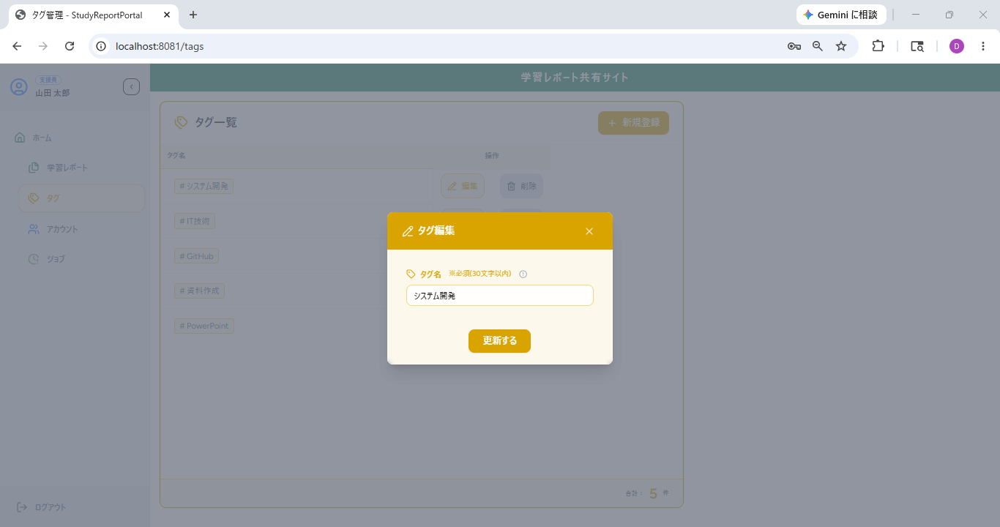 |

|                      アカウント一覧                       |                      アカウント詳細                      |
| :-------------------------------------------------------: | :------------------------------------------------------: |
| 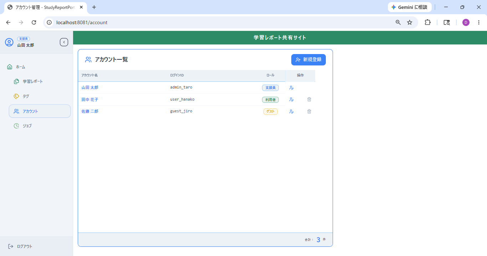 | 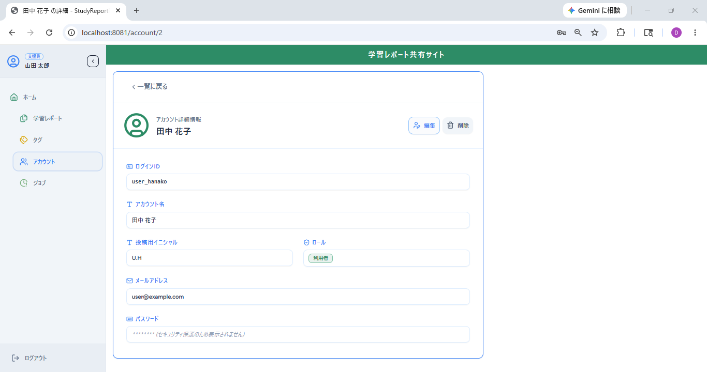 |

## ドキュメント

- 業務要件定義書
- 画面遷移図
- 技術支援（チーム開発資料）
  - 環境構築手引き
  - Github運用ガイド
  - コマンド集
